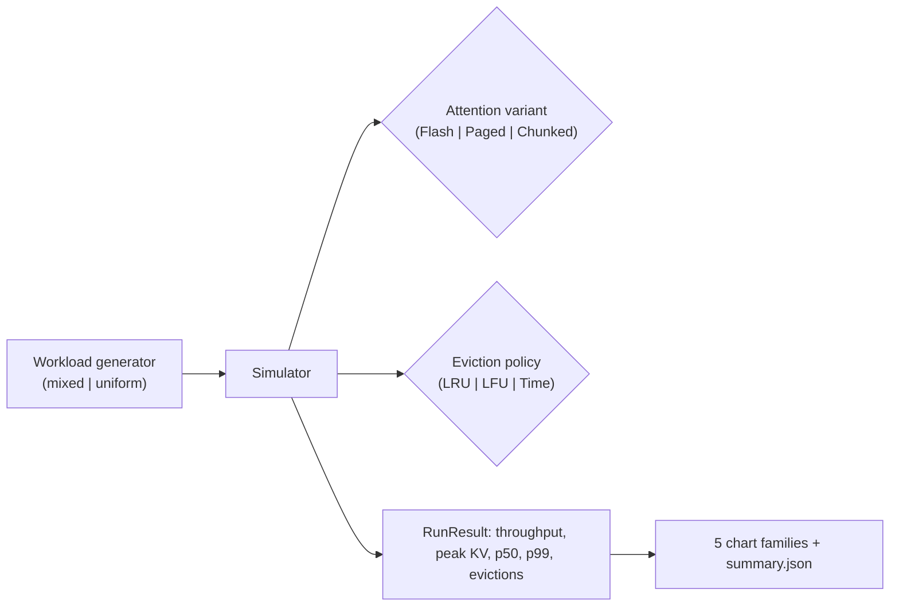

# kv-cache-optimizer

> KV-cache benchmarking and eviction-policy ablation across three attention variants (Flash, Paged, Chunked-prefill). Discrete-step simulator, reproducible on a laptop.
> Last updated: 2024-04-18.

`kv-cache-optimizer` is a discrete-step simulator that models KV-cache memory pressure, eviction behavior, and throughput across three attention variants and three eviction policies. Each variant carries calibrated per-token byte sizes and prefill/decode speed multipliers; each policy implements a per-request eviction decision. The output is a 27-cell sweep over (variant x eviction x capacity) with five chart families.

## Headline (fixture: `n_requests=200`, `seed=17`)

| metric | value |
|---|---|
| sweep cells | 27 (3 variants x 3 evictions x 3 capacities) |
| requests per cell | 200 |
| best throughput (variant, eviction) | Paged + LFU at 29.77 tokens/step |
| best p99 latency (variant, eviction) | Flash + LFU at 185.9 steps |
| most evictions | Flash + LRU at 196 sessions |
| 256 MB capacity cells | zero evictions across all (variant, policy) pairs |

Reproduce: `make install && make bench && make report`.

## Why a simulator and not a real GPU run

Real KV-cache benchmarks need a GPU. The simulator is for two scenarios:

1. The architectural question "which variant should I deploy?" - the rank ordering of variants is what matters, and that's preserved by the calibrated speed multipliers.
2. Comparing eviction policies under a controlled workload - much easier to do in a simulator than in a real serving stack.

For real-hardware numbers, swap the simulator for vLLM (Paged) or a chunked-prefill fork; the metric definitions and the chart code are unchanged.

## Pipeline



## Five chart families

- `results/figures/throughput.png` - throughput grouped bar (variant x eviction)
- `results/figures/memory.png` - peak KV box-plot per variant
- `results/figures/latency_pareto.png` - throughput vs p99 latency scatter
- `results/figures/evictions.png` - eviction count grouped bar
- `results/figures/latency_violin.png` - p50/p99 violin per variant

## Repo layout

```
src/kvopt/
  types.py                  # Request, AttentionVariant, EvictionPolicy, RunResult
  workload/generator.py     # mixed + uniform workloads
  attention/variants.py     # per-variant cost profile
  eviction/policies.py      # LRU, LFU, Time
  sim/simulator.py          # discrete-step simulator
  viz/charts.py             # 5 chart families
  cli/main.py               # `kvopt bench`, `kvopt report`
  runner.py
tests/                      # 13 tests, all green
docs/research_report.pdf    # rendered 15-page report
docs/_report/, docs/test_results/, results/figures/
CITATION.cff, LICENSE, Makefile, .github/workflows/ci.yml
```

## Quick start

```bash
make install   # uv sync --extra dev
make test      # pytest + mypy --strict + ruff
make bench     # sweep variants x evictions x capacities -> summary.json + 5 PNGs
make report    # pretty-print the per-run table
make pdf       # render docs/research_report.pdf
```

## Documentation

Long-form research report: [`docs/research_report.pdf`](./docs/research_report.pdf) (rendered) and [`docs/_report/research_report.md`](./docs/_report/research_report.md) (markdown source). Regenerate the PDF with `make pdf` (requires `pandoc` + `xelatex`).

Test artifacts (captured locally):

- [`docs/test_results/pytest_output.txt`](./docs/test_results/pytest_output.txt)
- [`docs/test_results/quality_gates.txt`](./docs/test_results/quality_gates.txt)
- [`docs/test_results/coverage_summary.txt`](./docs/test_results/coverage_summary.txt)

## References

- Dao et al., "FlashAttention: Fast and Memory-Efficient Exact Attention with IO-Awareness" (2022)
- Kwon et al., "Efficient Memory Management for Large Language Model Serving with PagedAttention" (vLLM, 2023)
- Agrawal et al., "SARATHI: Efficient LLM Inference by Piggybacking Decodes with Chunked Prefills" (2023)

## License

MIT.
