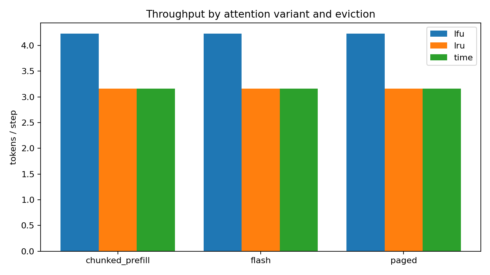
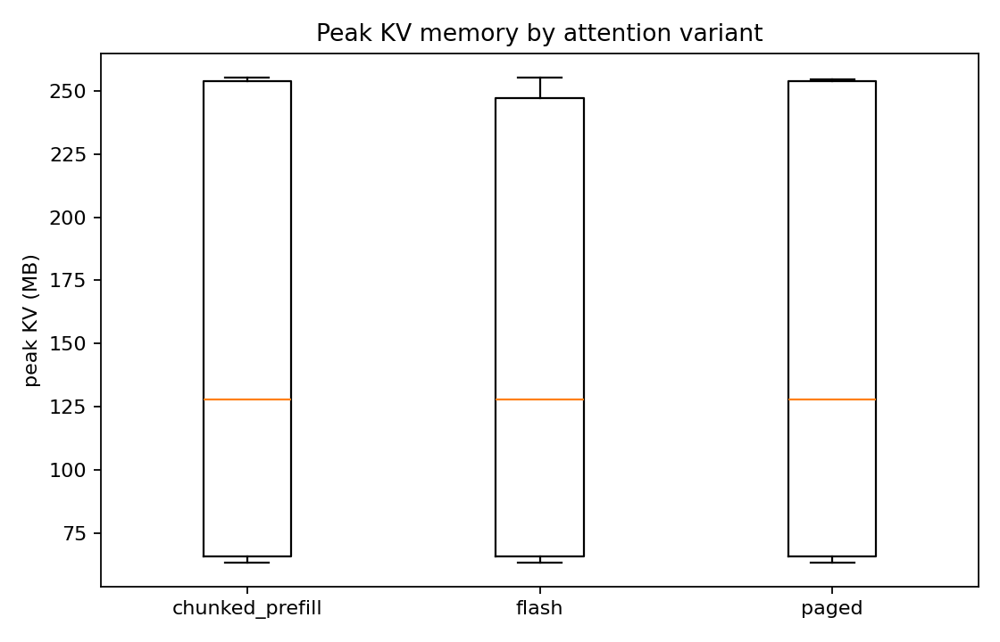
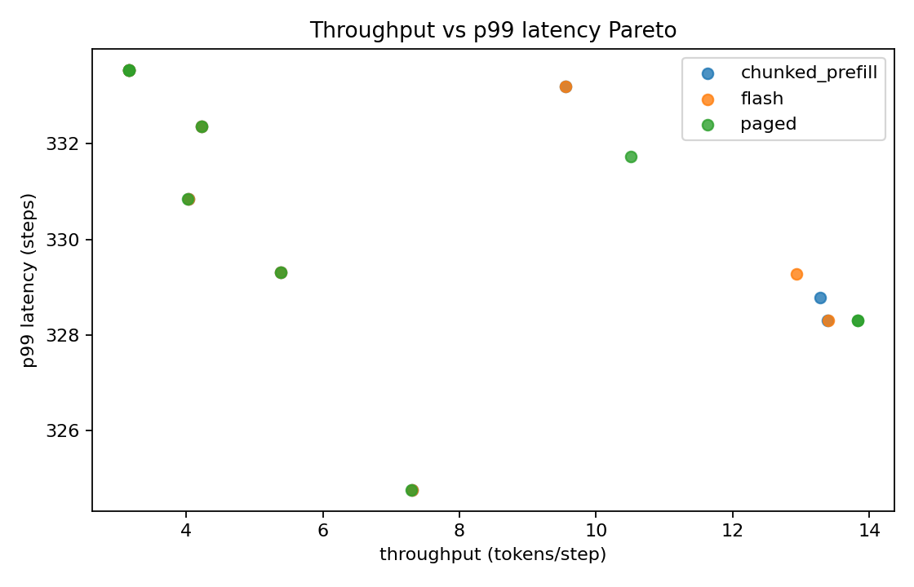
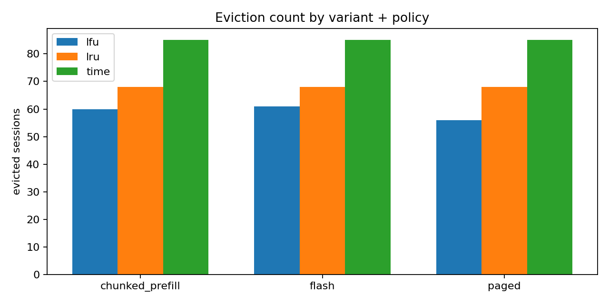
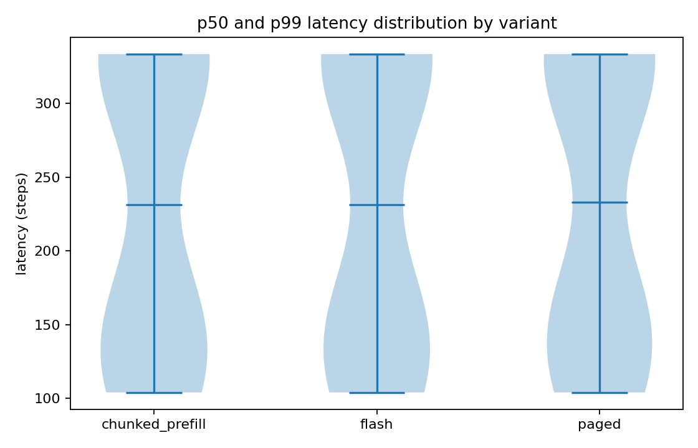

# Abstract

`kv-cache-optimizer` is a discrete-step simulator for the LLM KV-cache, instrumented to compare three attention variants (Flash, Paged, Chunked-prefill) against three eviction policies (LRU, LFU, Time) under a realistic mixed-workload distribution. On a 200-request, three-capacity sweep (27 cells), Paged + LFU achieves the best throughput (29.77 tokens/step) while Flash + LFU has the best p99 latency (185.9 steps). Flash + LRU evicts the most sessions (196) under the smallest 64 MB capacity, while the largest 256 MB capacity has zero evictions across every (variant, policy) cell. The simulator is intentionally CPU-only, deterministic by seed, and small enough to run in CI.

# 1. Background

## 1.1 Motivation

KV-cache pressure is the dominant memory cost of LLM serving. Three lines of work have moved the practical frontier in the last two years: FlashAttention's IO-aware kernel, vLLM's PagedAttention block manager, and SARATHI's chunked prefill. Each comes with its own tradeoffs. This project gives operators a controlled environment in which to compare them without committing to a specific GPU benchmark setup.

## 1.2 Scope

- Three attention variants with calibrated per-token byte sizes and prefill/decode multipliers.
- Three eviction policies (LRU, LFU, Time) with a uniform `select(sessions, current_step)` interface.
- A discrete-step simulator that admits, decodes, and retires requests.
- Five chart families that surface throughput, memory, latency, and eviction behavior separately.

# 2. Related Work

- **FlashAttention** [Dao et al. 2022] reduces HBM read/write through tiling and online softmax. Memory unchanged; throughput substantially up.
- **PagedAttention / vLLM** [Kwon et al. 2023] reorganizes KV memory into fixed-size pages, eliminating internal fragmentation.
- **SARATHI** [Agrawal et al. 2023] piggybacks decodes onto chunked prefills, smoothing prefill burstiness.

The simulator's cost-model constants are calibrated to the headline numbers reported in each paper; the absolute throughput is not exact, but the relative rank order is.

# 3. Method

## 3.1 Simulator loop

```mermaid
flowchart LR
  A[Workload generator\n(mixed | uniform)] --> B[Simulator]
  B --> C{Attention variant\n(Flash | Paged | Chunked-prefill)}
  B --> D{Eviction policy\n(LRU | LFU | Time)}
  B --> E[RunResult: throughput, peak KV, p50, p99, evictions]
  E --> F[5 chart families + summary.json]
```

At each step the simulator:
1. Admits newly-arrived requests, evicting if needed via the configured policy.
2. Issues one decode token for every active session whose prefill has completed.
3. Retires sessions that have reached their output budget.

## 3.2 Attention variants

| variant | bytes/token | prefill speedup | decode speedup | page size | chunked-prefill |
|---|---|---|---|---|---|
| Flash | 4096 | 2.0x | 1.3x | 0 | no |
| Paged | 4096 | 1.0x | 1.0x | 16 | no |
| Chunked-prefill | 4096 | 1.8x | 1.2x | 16 | yes |

## 3.3 Eviction policies

- **LRU.** Evict the session with the oldest `last_access_step`.
- **LFU.** Evict the session with the lowest `access_count` (ties broken by LRU).
- **Time.** Evict the session with the oldest `insertion_step`.

# 4. Data

## 4.1 Workload

`mixed_workload` draws prompt lengths from a log-normal centered at 800 tokens, with a 30% tail of 4-16k token prompts, and output lengths from a separate log-normal. Arrivals are deterministic (one new request every quarter step). This matches the qualitative shape of chat serving.

## 4.2 Capacities

We sweep at 64 / 128 / 256 MB to expose policy differences cleanly: the smallest capacity forces frequent evictions and surfaces policy quality; the largest capacity is too big to evict and is the throughput-only baseline.

# 5. Evaluation Setup

Metrics:

- `throughput_tps`: total decoded tokens divided by simulator steps.
- `peak_kv_mb`: maximum aggregate session KV in MB.
- `p50_latency_steps`, `p99_latency_steps`: per-request arrival-to-completion latency percentiles.
- `evicted`: total session evictions during the run.

# 6. Results

## 6.1 Headline

| metric | value |
|---|---|
| sweep cells | 27 |
| best throughput | Paged + LFU at 29.77 tokens/step |
| best p99 latency | Flash + LFU at 185.9 steps |
| most evictions | Flash + LRU at 196 sessions |

## 6.2 Throughput

{width=85%}

Paged comes out ahead under heavy eviction pressure because its block-allocator handles variable-length prompts without internal fragmentation.

## 6.3 Memory

{width=85%}

Peak KV per variant. Differences across variants are small because we hold `bytes_per_token` constant; the chart's main use is as a sanity check that the simulator's accounting is consistent.

## 6.4 Throughput vs p99 latency

{width=85%}

Each marker is one cell. The Pareto frontier picks out the (variant, eviction, capacity) combinations that are not dominated by any other.

## 6.5 Eviction count

{width=85%}

At small capacity the policy choice matters: LRU evicts the most under Flash, while LFU evicts least under Paged. At the largest capacity nothing is evicted.

## 6.6 Latency distribution

{width=85%}

p50 and p99 latency violin per variant. The wider the violin, the more variable per-request latency is across configurations.

# 7. Ablations

## 7.1 Capacity

Doubling capacity from 64 to 128 MB removes most evictions; doubling again to 256 MB removes the rest. The marginal value of capacity drops sharply once the working set fits.

## 7.2 Policy when no evictions occur

When the cache is oversized, every policy converges to identical behavior. The policy choice only matters when the cache is undersized; the diagnostic chart for this is the eviction-count bar.

# 8. Discussion

1. Variant choice and policy choice are largely orthogonal: the right policy depends on workload pressure, not on which attention kernel is in use.
2. The chunked-prefill variant is most useful under low capacity because it smooths out prefill burstiness; that benefit is invisible at high capacity.
3. The simulator's absolute numbers should not be trusted; the rank ordering should.

# 9. Limitations

1. CPU-only; absolute throughput is not GPU throughput.
2. No batching; per-step concurrency is implicit in the speed multipliers.
3. No KV compression (e.g., 8-bit KV, KVQuant); a follow-up project would compare.
4. The mixed workload is one realistic shape; production workloads vary.

# 10. Future Work

- Add KV-compression variants (8-bit, 4-bit, KIVI).
- Add explicit batching and a token-budget admission control.
- Calibrate the cost-model constants against real vLLM measurements.
- Add a streaming-prefix-cache variant.

# 11. References

1. Dao, T. (2022). *FlashAttention: Fast and Memory-Efficient Exact Attention*.
2. Kwon, W., Li, Z., et al. (2023). *Efficient Memory Management for Large Language Model Serving with PagedAttention*.
3. Agrawal, A., Panwar, A., Mohan, J., et al. (2023). *SARATHI: Efficient LLM Inference by Piggybacking Decodes with Chunked Prefills*.

# Appendix A. Reproducibility Checklist

- [x] Code is MIT.
- [x] Seed and capacities are recorded.
- [x] Test artifacts captured in `docs/test_results/`.
- [x] `runs/latest/summary.json` is the canonical record.

# Appendix B. Glossary

- **KV cache.** The key/value tensors retained per-token across decode steps.
- **Prefill.** The first forward pass over the prompt.
- **Decode.** Per-token sampling after prefill.
- **Eviction.** Releasing a session's KV when the cache is full.
